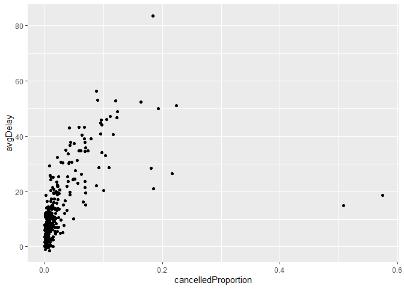

hw1
================
2022-09-27

Github repo: <https://github.com/essenter/hw1stats433>

``` r
library(nycflights13)
library(tidyverse)
```

    ## ── Attaching packages ─────────────────────────────────────── tidyverse 1.3.2 ──
    ## ✔ ggplot2 3.3.6      ✔ purrr   0.3.4 
    ## ✔ tibble  3.1.8      ✔ dplyr   1.0.10
    ## ✔ tidyr   1.2.1      ✔ stringr 1.4.1 
    ## ✔ readr   2.1.2      ✔ forcats 0.5.2 
    ## ── Conflicts ────────────────────────────────────────── tidyverse_conflicts() ──
    ## ✖ dplyr::filter() masks stats::filter()
    ## ✖ dplyr::lag()    masks stats::lag()

``` r
library(dplyr)
```

\##Question 1##

How many flights have a missing dep_time? What other variables are
missing? What might these rows represent?

``` r
flights %>% filter(is.na(dep_time))
```

    ## # A tibble: 8,255 × 19
    ##     year month   day dep_time sched_de…¹ dep_d…² arr_t…³ sched…⁴ arr_d…⁵ carrier
    ##    <int> <int> <int>    <int>      <int>   <dbl>   <int>   <int>   <dbl> <chr>  
    ##  1  2013     1     1       NA       1630      NA      NA    1815      NA EV     
    ##  2  2013     1     1       NA       1935      NA      NA    2240      NA AA     
    ##  3  2013     1     1       NA       1500      NA      NA    1825      NA AA     
    ##  4  2013     1     1       NA        600      NA      NA     901      NA B6     
    ##  5  2013     1     2       NA       1540      NA      NA    1747      NA EV     
    ##  6  2013     1     2       NA       1620      NA      NA    1746      NA EV     
    ##  7  2013     1     2       NA       1355      NA      NA    1459      NA EV     
    ##  8  2013     1     2       NA       1420      NA      NA    1644      NA EV     
    ##  9  2013     1     2       NA       1321      NA      NA    1536      NA EV     
    ## 10  2013     1     2       NA       1545      NA      NA    1910      NA AA     
    ## # … with 8,245 more rows, 9 more variables: flight <int>, tailnum <chr>,
    ## #   origin <chr>, dest <chr>, air_time <dbl>, distance <dbl>, hour <dbl>,
    ## #   minute <dbl>, time_hour <dttm>, and abbreviated variable names
    ## #   ¹​sched_dep_time, ²​dep_delay, ³​arr_time, ⁴​sched_arr_time, ⁵​arr_delay

There are 8,255 with a missing departure time. The rows that are missing
dep_time are also missing dep_delay, arr_time, arr_delay, and air_time.
It is likely that these rows represent cancelled flights.

\##Question 2##

Currently dep_time and sched_dep_time are convenient to look at, but
hard to compute with because they’re not really continuous numbers.
Convert them to a more convenient representation of number of minutes
since midnight.

``` r
flights_depMin <- flights %>% mutate(dep_time_min = (dep_time%%100) + 60*(dep_time%/%100), sched_dep_time_min = (sched_dep_time%%100) + 60*(sched_dep_time%/%100))

flights_depMin %>% select(dep_time, sched_dep_time, dep_time_min, sched_dep_time_min)
```

    ## # A tibble: 336,776 × 4
    ##    dep_time sched_dep_time dep_time_min sched_dep_time_min
    ##       <int>          <int>        <dbl>              <dbl>
    ##  1      517            515          317                315
    ##  2      533            529          333                329
    ##  3      542            540          342                340
    ##  4      544            545          344                345
    ##  5      554            600          354                360
    ##  6      554            558          354                358
    ##  7      555            600          355                360
    ##  8      557            600          357                360
    ##  9      557            600          357                360
    ## 10      558            600          358                360
    ## # … with 336,766 more rows

\##Question 3##

Look at the number of canceled flights per day. Is there a pattern? Is
the proportion of canceled flights related to the average delay? Use
multiple dyplr operations, all on one line, concluding with
ggplot(aes(x= ,y=)) + geom_point()

``` r
flights %>% 
  group_by(year, month, day) %>% 
  summarise(cancelled = sum(is.na(dep_time)), cancelledProportion = cancelled/n(), avgDelay = mean(dep_delay, na.rm = T)) %>% 
  ggplot(aes(x=cancelledProportion, y=avgDelay)) + geom_point()
```

    ## `summarise()` has grouped output by 'year', 'month'. You can override using the
    ## `.groups` argument.

<!-- -->

There are some days that only have a small number of flights cancelled,
but there are some days with a very large amount of flights cancelled.
It seems as if days with bad weather or other circumstances cause there
to be a lot of flights cancelled, but days with only a couple flights
cancelled are likely from extenuating circumstances. When there is a
higher proportion of flights cancelled there seems to be a large average
delay.
